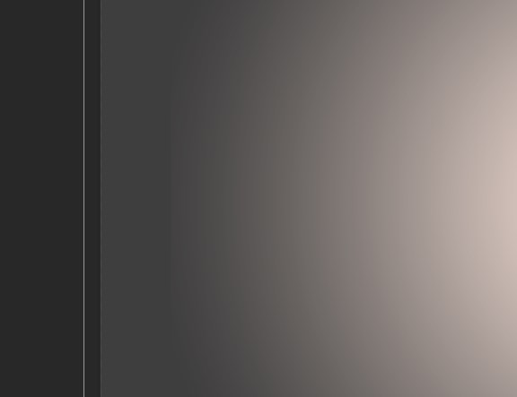

# Gllacy Bugs

##### 1) Фактические размеры колонок в макете немного не соответствуют ТЗ.
При построении макета по ТЗ размер колонок (при максимальной ширине в 1200px)
* в 2-колоночной сетке — 559.2 px (на макете 560 px);
* в 4-колоночной сетке — 266.4 px (на макете 267 px);

Погрешность, конечно некритичная, но надо указать, что ТЗ приоритетнее макета

##### 2) Круглые изображения мороженого в макете без возможности экспорта квадратных
(которые, скорее всего и будут в живом проекте)

##### 3) Лишний пункт в ТЗ
Пожелания к поведению блоков > Все макеты: «Если пользователь сделал закладку или добавил что-то в корзину, соответствующий пункт в главной навигации меняет цвет фона на красный»

##### 4) Много вариаций размеров кнопок
- font-size: 15 (высота кнопки 35)
    * в форме корзины «Оформить заказ»,
    *  логин «Войти»,
    * карточки товара «Быстрый просмотр»

- font-size: 17 (высота кнопки 44)
    * блок контакты «форма обратной связи»
    * форма обратной связи «Отправить»
    * блок с подпиской «Отправить»

- font-size: 18 (высота кнопки 46)
    * баннеры «Хочу варенье» «Хочу шоколадки»

##### 5) Кнопка в отличие от надписи не отцентрована

##### 6) Расхождения в тексте
На макете 900 не хватает слов «и добавки» (после «Все дополнительные ингридиенты»)

##### 7) Есть ли смысл в разной высоте инпутов?
- 38 (в формах шапки — поиск и окно авторизации)

- 44 (в остальных формах)

##### 8) Цвет фона кнопки (обычное состояние) в форме фильтров
сделан при помощи заливки (19), хотя у самих фильтров фон сделан при помощи прозрачности

##### 9) Цвет фона кнопки (hover) в форме фильтров
заливка (99), хотя у аналогичных по дизайну элементов ее нет. Возможно, стоит указать такой же цвет как и формы с селектом (#ffffff вместо #fafbfb)

 Цвет фона кнопки (active) в форме фильтров
опять заливка (99), плюс наложение цвета на изначально белый (комбо!). Возможно, стоит сделать по аналогии с цветом фона у форм

##### 11) Различия в цвете фона фильтров и других элементов

##### 12) Цвет фона социальной кнопки (active)
заливка (99)

##### 13) Тень маркера фильтра по цене
так уж неоходим угол освещения?

##### 14) Цвет текста «Сделано в HTML Academy»
#fefefe, хотя в навигации #ffffff

##### 15) В выпадающем меню должен быть пункт «по популярности»
#fefefe, хотя в навигации #ffffff

##### 16) Отступы — расхождения в макетах
если делать пиксель-перфект для одного макета (1200), то будут расхождения в другом (900). Также полностью касается футера

##### 17) Кнопки на разных уровнях

##### 18) Блок контактов не отцентрован по высоте относительно карты

##### 19) Градиент обрезан для коричневого фона на главной странице

##### 20) Разные отступы слева у текста в полях формы

 
 
 
 
 Пожелание — сделайте кнопку на карточках «добавить в корзину», или что-то подобное, чтобы при желании учащийся мог счётчики в шапке изменять, а то слишком мало js по сравнению с техномартом
